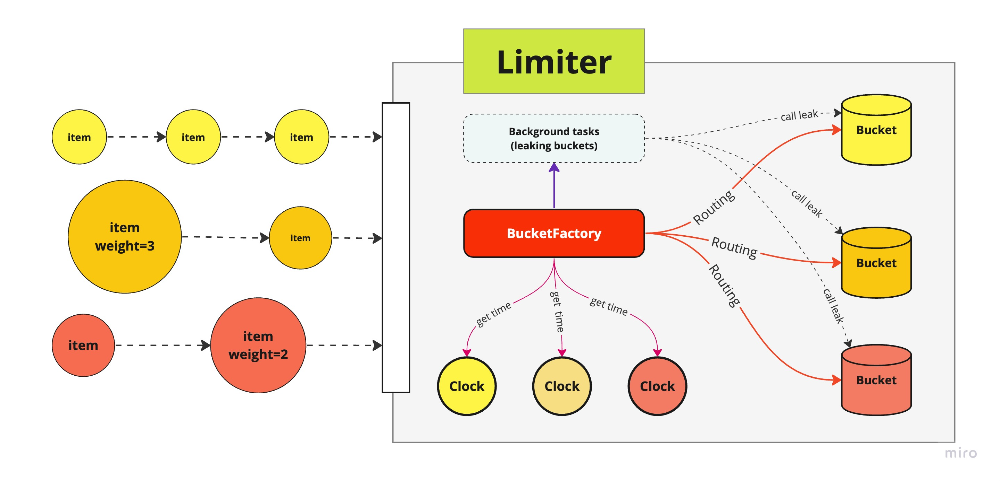

# PyrateLimiter
The request rate limiter using Leaky-bucket algorithm.

Full project documentation can be found at [pyratelimiter.readthedocs.io](https://pyratelimiter.readthedocs.io).

[](https://badge.fury.io/py/pyrate-limiter)
[](https://pypi.org/project/pyrate-limiter)
[](https://codecov.io/gh/vutran1710/PyrateLimiter)
[](https://github.com/vutran1710/PyrateLimiter/graphs/commit-activity)
[](https://pypi.python.org/pypi/pyrate-limiter/)

<br>

## Contents
- [PyrateLimiter](#pyratelimiter)
  - [Contents](#contents)
  - [Features](#features)
  - [Installation](#installation)
  - [Understanding design](#understanding-design)
  - [Basic usage](#basic-usage)
    - [Defining rate limits](#defining-rate-limits)
    - [Defining clock & routing logic](#defining-clock--routing-logic-with-bucketfactory)
    - [Wrapping all up with Limiter](#wrapping-all-up-with-limiter)
    - [Weight](#weight)
  - [Handling exceeded limits](#handling-exceeded-limits)
    - [Bucket analogy](#bucket-analogy)
    - [Rate limit exceptions](#rate-limit-exceptions)
    - [Rate limit delays](#rate-limit-delays)
  - [Additional knowledge](#additional-knowledge)
    - [Clock as Time source](#clock-as-time-sources)
    - [Leaking](#leaking)
    - [Async decorator/contextmanager](#async-decoratorcontextmanager)
  - [Backends](#backends)
    - [Memory](#memory)
    - [SQLite](#sqlite)
    - [Redis](#redis)
    - [Custom backends / Bucket contribution](#add-new-custom-backends)
  - [Additional features](#additional-features)
    - [Time sources](#time-sources)
  - [Examples](#examples)

## Features
* Tracks any number of rate limits and intervals you want to define
* Independently tracks rate limits for multiple services or resources
* Handles exceeded rate limits by either raising errors or adding delays
* Several usage options including a normal function call, a decorator
* Out-of-the-box workable with both sync & async
* Includes optional SQLite and Redis backends, which can be used to persist limit tracking across
  multiple threads, or application restarts

## Installation
**PyrateLimiter** supports **python ^3.8**

Install using pip:
```
pip install pyrate-limiter
```

Or using conda:
```
conda install --channel conda-forge pyrate-limiter
```

## Understanding design
### Key Components





#### Clock
- Timestamp-ing items

#### Bucket
- Hold timestamped items.
- Behave like a FIFO queue
- It can `leak` - popping items that are no longer relevant out of the queue

#### BucketFactory
- An application may use more than just one type of Bucket
- An application may use more than just one type of Clock
- BucketFactory keeps refererences to buckets & clocks: it timestamps received items, and routes them to their corresponding buckets
- Help create background tasks to run buckets' `leak` intervally to make sure buckets wont explode
- Most of the time, it is the only place where users go to to implement their own logic

#### Limiter
- Its most important responsibility is to make user's life as much easy as it should be
- It sums up all the underlying logic to a simple, intuitive API to work with
- It helps dealing with async/sync context (everything just `works` by adding/removing `async/await` keyword to the user's code)
- It provides different ways of interacting with the underlying BucketFactory *(plain method call, decorator, context-manager (TBA))*
- It provides thread-safety using RLock


## Basic usage

### Defining rate limits & buckets
Consider some public API (like LinkedIn, GitHub, etc.) that has rate limits like the following:
```
- 500 requests per hour
- 1000 requests per day
- 10000 requests per month
```

You can define these rates using the `Rate` class. `Rate` class has 2 properties only: **limit** and **interval**
``` python
from pyrate_limiter.abstracts.rate import Duration, Rate

hourly_rate = Rate(500, Duration.HOUR) # 500 requests per hour
daily_rate = Rate(1000, Duration.DAY) # 1000 requests per day
monthly_rate = Rate(10000, Duration.MONTH) # 10000 requests per month

rates = [hourly_rate, daily_rate, monthly_rate]
```

Rates must be properly ordered:
- Rates' intervals & limits must be ordered from least to greatest
- Rates' ratio of **limit/interval** must be ordered from greatest to least

Then, add the rates to the bucket of your choices
```python
from pyrate_limiter.buckets import InMemoryBucket, RedisBucket

basic_bucket = InMemoryBucket(rates)

# Or, using redis
from redis import Redis

redis_connection = Redis(host='localhost')
redis_bucket = RedisBucket.init(rates, redis_connection, "my-bucket-name")

# Async Redis would work too!
from redis.asyncio import Redis

redis_connection = Redis(host='localhost')
redis_bucket = await RedisBucket.init(rates, redis_connection, "my-bucket-name")
```

Existing implementations of Bucket come with rate-validation when init. If you are to use your own implementation, use the validator provided by the lib

```python
from pyrate_limiter.utils import validate_rate_list

assert validate_rate_list(my_rates)
```

### Defining Clock & routing logic with BucketFactory

Now as you already have your buckets, it's time to define what `Time` is (funny?!). Most of the time, you can use the existing Clock backend provided by **pyrate_limiter**.

```python
from pyrate_limiter.clock import TimeClock, MonotonicClock, SQLiteClock

base_clock = TimeClock()
```

**PyrateLimiter** makes no assumption about users logic, so to map coming items to their correct buckets, implement your own **BucketFactory** class. Don't worry, it's very easy! At minimum, there are only 2 methods require implementing

```python
from pyrate_limiter.abstracts import BucketFactory
from pyrate_limiter.abstracts import AbstractBucket


class MyBucketFactory(BucketFactory):
    # You can use constructor here,
    # nor it requires to make bucket-factory work!

    def wrap_item(self, name: str, weight: int = 1) -> RateItem:
        """Time-stamping item, return a RateItem"""
        now = clock.now()
        return RateItem(name, now, weight=weight)

    def get(self, _item: RateItem) -> AbstractBucket:
        """For simplicity's sake, all items route to the same, single bucket"""
        return bucket
```

### Wrapping all up with Limiter

Pass your bucket-factory to Limiter, and ready to roll!
```python
from pyrate_limiter import Limiter

limiter = Limiter(
    bucket_factory,
    raise_when_fail=False,  # Default = True
    allowed_delay=1000,     # Default = None
)

item = "the-earth"
limiter.try_acquire(item)

heavy_item = "the-sun"
limiter.try_acquire(heavy_item, weight=10000)
```

If your bucket's backend is `async`, well, we got you covered! Passing `await` to the limiter is enought to make it scream!

```python
await limiter.try_acquire(item)
```

Alternatively, you can use `Limiter.try_acquire` as a function decorator. But you have to provide a `mapping` function that map the wrapped function's arguments to a proper `limiter.try_acquire` argument - which is a tuple of `(str, int)` or just `str`
```python
my_beautiful_decorator = limiter.as_decorator()

def mapping(some_number: int):
    return str(some_number)

@my_beautiful_decorator(mapping)
def request_function(some_number: int):
    requests.get('https://example.com')

# Async would work too!
@my_beautiful_decorator(mapping)
async def async_request_function(some_number: int):
    requests.get('https://example.com')
```

### Weight

Item can have weight. By default item's weight = 1, but you can modify the weight before passing to `limiter.try_acquire`.

Item with weight W > 1 when consumed will be multiplied to (W) items with the same timestamp and weight = 1. Example with a big item with weight W=5, when put to bucket, it will be divided to 5 items with weight=1 + following names

```
BigItem(weight=5, name="item", timestamp=100) => [
    item(weight=1, name="item", timestamp=100),
    item(weight=1, name="item", timestamp=100),
    item(weight=1, name="item", timestamp=100),
    item(weight=1, name="item", timestamp=100),
    item(weight=1, name="item", timestamp=100),
]
```

See [Additional usage options](#additional-usage-options) below for more details.

## Handling exceeded limits
When a rate limit is exceeded, you have two options: raise an exception, or add delays.

### Bucket analogy


At this point it's useful to introduce the analogy of "buckets" used for rate-limiting. Here is a
quick summary:

* This library implements the [Leaky Bucket algorithm](https://en.wikipedia.org/wiki/Leaky_bucket).
* It is named after the idea of representing some kind of fixed capacity -- like a network or service -- as a bucket.
* The bucket "leaks" at a constant rate. For web services, this represents the **ideal or permitted request rate**.
* The bucket is "filled" at an intermittent, unpredicatble rate, representing the **actual rate of requests**.
* When the bucket is "full", it will overflow, representing **canceled or delayed requests**.
* Item can have weight. Consuming a single item with weight W > 1 is the same as consuming W smaller, unit items - each with weight=1, with the same timestamp and maybe same name (depending on however user choose to implement it)

### Rate limit exceptions
By default, a `BucketFullException` will be raised when a rate limit is exceeded.
The error contains a `meta_info` attribute with the following information:
* `name`: The name of item it received
* `rate`: The specific rate that has been exceeded

Here's an example that will raise an exception on the 4th request:
```python
rate = Rate(3, Duration.SECOND)
bucket = InMemoryBucket([rate])
clock = TimeClock()


class MyBucketFactory(BucketFactory):

    def wrap_item(self, name: str, weight: int = 1) -> RateItem:
        """Time-stamping item, return a RateItem"""
        now = clock.now()
        return RateItem(name, now, weight=weight)

    def get(self, _item: RateItem) -> AbstractBucket:
        """For simplicity's sake, all items route to the same, single bucket"""
        return bucket


limiter = Limiter(MyBucketFactory())

for _ in range(4):
    try:
        limiter.try_acquire('item')
    except BucketFullException as err:
        print(err)
        # Output: Bucket with Rate 3/1.0s is already full
        print(err.meta_info)
        # Output: {'name': 'item', 'rate': '3/1.0s', 'error': 'Bucket with Rate 3/1.0s is already full'}
```

The rate part of the output is constructed as: `limit / interval`. On the above example, the limit
is 3 and the interval is 1, hence the `Rate 3/1`.

### Rate limit delays
You may want to simply slow down your requests to stay within the rate limits instead of canceling
them. In that case you pass the `allowed_delay` argument the maximum value of delay (typically in *ms* when use human-clock).

```python
limiter = Limiter(factory, allowed_delay=500) # Allow to delay up to 500ms
```

When `allowed_delay` is passed as a numeric value, when ingesting item, limiter will:
- First, try to ingest such item using the routed bucket
- If it fails to put item into the bucket, it will call `wait(item)` on the bucket to see how much time will be until the bucket can consume the item again?
- Comparing the `wait` value to the `allowed_delay`.
- if `allowed_delay` >= `wait`: delay (wait + 50ms as latency-tolerance) until the bucket can consume again
- if `allowed_delay` < `wait`: it raises `LimiterDelayException` if Limiter's `raise_when_fail=True`, otherwise silently fail and return False

## Additional knowledge


### Clock as Time sources
Time source can be anything from anywhere: be it python's built-in time, or monotonic clock, sqliteclock, or crawling from world time server(well we dont have that, but you can!).

```python
from pyrate_limiter.clocks import TimeClock      # use python' time.time()
from pyrate_limiter.clocks import MonotonicClock # use python time.monotonic()
```

Clock's abstract interface only requires implementing a method `now() -> int`. And it can be both sync or async.


### Leaking
Typically bucket should not hold items forever. Therefore Bucket's abstract interface requires its implementation must be provided with `leak(current_timestamp: Optional[int] = None)`.

The `leak` method just needs to be a function that will remove outdated items at that very momement it gets called. During the limiter lifetime, every bucket `leak` should be called periodically to clean up.

BucketFactory provide a method called `schedule_leak` to help deal with this matter. Basically, it will run **1(one)** background task for the specific bucket, where interval between `leak` call = the bucket's last rate's interval * 2.

```python
# Runnning a background task (whether it is sync/async - doesnt matter)
# calling the bucket's leak, using the clock as `bucket.leak(clock.now())`
# interval between call = bucket.rates[-1].interval * 2 (ms)
factory.schedule_leak(bucket, clock)
```

You can change this calling interval by overriding BucketFactory's `leak_interval`. For example, use the first rate's interval or a fixed value

```python
class MyBucketFactory(BucketFactory):
    ... other implementations

    def leak_interval(self, bucket):
        if isinstance(bucket, InMemoryBucket):
            return bucket.rates[0].interval

        if isinstance(bucket, RedisBucket):
            return 10_000

        return super().leak_interval()
```

When dealing with leak using BucketFactory, the author's suggestion is, we can be pythonic about this by implementing a constructor

```python
class MyBucketFactory(BucketFactory):

    def constructor(self, clock, buckets):
        self.clock = clock
        self.buckets = buckets

        for bucket in buckets:
            self.schedule_leak(bucket, clock)

```

After this, our buckets are safe to use without worrying about them exploding ever!

## Backends
A few different bucket backends are available:
- InMemoryBucket using python built-in list as bucket
- RedisBucket, using err... redis, with both async/sync support
- SQLite, using sqlite3

### InMemoryBucket
The default bucket is stored in memory, using python `list`

```python
from pyrate_limiter.buckets import InMemoryBucket
```

This bucket only availabe in `sync` mode. The only constructor argument is `List[Rate]`.

### RedisBucket
RedisBucket uses `Sorted-Set` to store items with key being item's name and score item's timestamp
Because it is intended to work with both async & sync, we provide a classmethod `init` for it

```python
from pyrate_limiter.buckets import RedisBucket

class RedisBucket
    ...other implementations

    @classmethod
    def init(
        cls,
        rates: List[Rate],
        redis: Union[Redis, AsyncRedis],
        bucket_key: str,
    ):
        pass
```

The API are the same, regardless of sync/async. If AsyncRedis is being used, calling `await bucket.method_name(args)` would just work!

### SQLite
If you need to persist the bucket state, a SQLite backend is available.

Manully create a connection to Sqlite and pass it along with the table name to the bucket class:

```python
from pyrate_limiter.buckets import SQLiteBucket

class SQLiteBucket(AbstractBucket):
    ...other implementations

    def __init__(self, rates: List[Rate], conn: sqlite3.Connection, table: str):
        self.conn = conn
        self.table = table
        self.rates = rates
        self.lock = RLock()

```

#### Concurrency
Generally, Lock is provided at Limiter's level, except SQLiteBucket case.

### Add new, custom backends
If these don't suit your needs, you can also create your own bucket backend by implementing `pyrate_limiter.abstracts.AbstractBucket` class.

One of **PyrateLimiter** design goals is powerful extensibility and maximum ease of development.

It must be not only be a ready-to-use tool, but also a guide-line, or a framework that help implementing new features/bucket free of the most hassles.

Due to the composition nature of the library, it is possbile to write minimum code and validate the result:

- Fork the repo
- Implement `pyrate_limiter.abstracts.AbstractBucket`
- Add your own `create_bucket` method in `tests/conftest.py` and pass it to the `create_bucket` fixture
- Run the test suite to validate the result

If the tests pass through, the you are just good to go with your new, fancy bucket!


## Examples
For more complete examples, you can refer to [test_suites](./tests/test_limiter.py )
